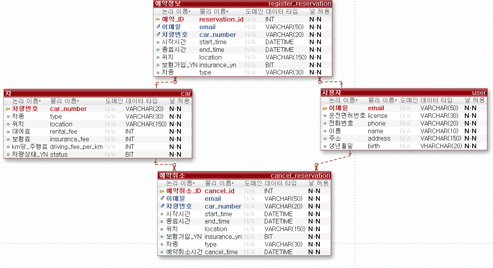

# sharingcar

#### 1. 프로젝트 소개
이 프로젝트는 공유차량을 사용자들이 원하는 시간대에 예약을 하고 운전할 수 있는 웹페이지를 만드는 프로젝트입니다.

#### 2. 프로젝트 기능
기능은 사용자 기능과 관리자 기능으로 나뉩니다.
##### 사용자
    -회원가입 기능
    -로그인 기능
    -차량 예약 기능
    -예약한 차량 확인 기능
    -예약 취소 기능
##### 관리자
    -공유 차량 추가 기능
    -차량 상태 바꾸기(사용가능, 차량 점검) 기능

#### 3. 기술 스택
스프링부트, 자바, MariaDB

#### 4. Documents
##### API
    추후 추가 예정
##### ERD
    

